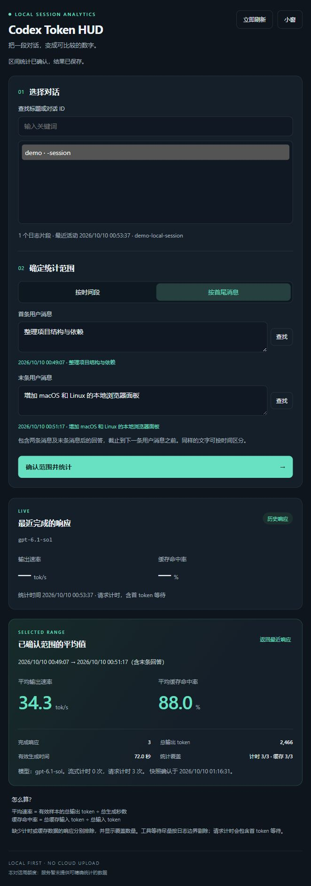
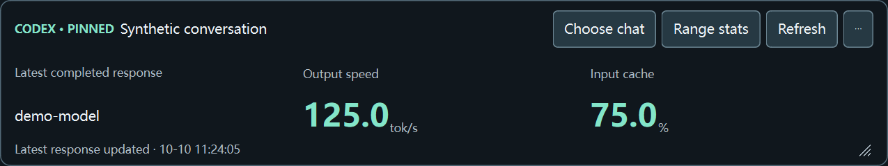

# Codex Token HUD

[English](README.md) | [简体中文](README.zh-CN.md)

Local Codex output speed and input cache statistics, with floating desktop HUDs for Windows/macOS/Linux, a portable browser dashboard, and terminal reports.

**Source version: 1.3.0-beta.5.** Independent project, unaffiliated with OpenAI. Reads local logs without changing Codex or uploading conversations.


## Select a range

Right-click the Windows strip or tray icon and open **区间统计：按时间或首尾消息…**. On macOS/Linux, use **Range stats** on the native strip, or start the dashboard directly.

1. Select a local conversation by title and ID.
2. Choose a start/end time, or search for the first and last user messages and select the matching timestamped results.
3. Confirm to see weighted average `tok/s`, weighted cache hit rate, completed responses, output tokens, measured duration and telemetry coverage. The matching desktop HUD switches to the confirmed range too.

A message range includes both boundary user messages and responses to the last message, ending before the next user message. A time range includes responses completed within the inclusive bounds, using the browser's local timezone. Repeated message text requires an explicit result selection.

**Average speed = total output tokens of timed samples / total generation seconds. Cache fraction = total cached input tokens / total input tokens.** Missing timing/cache data is excluded separately, never treated as zero. Reasoning tokens already included in output are not added again. Available log boundaries exclude tool execution; request timing includes time to first token.

Confirmed results are fixed snapshots. Confirm again to update, or use **返回最近响应** to restore the latest-response view. History is streamed on demand across resumed rollouts, without the live collector's 8 MiB tail limit.

<details>
<summary>Dashboard example (artificial conversation data)</summary>



</details>

## Native macOS/Linux HUD



Preview uses artificial data on the Windows Qt backend; macOS/Linux use the same widget layout with their native window backends.

Download the `native-overlay-macos-x64`, `native-overlay-macos-arm64`, `native-overlay-linux-x64` or `native-overlay-linux-arm64` artifact from a [successful CI run](https://github.com/drkang7/codex-token-hud/actions). Extract the inner ZIP/tar.gz completely. On macOS, move **CodexTokenHud.app** to Applications and open it. On Linux, run `./CodexTokenHud/CodexTokenHud`. These packages include Python and Qt; no pip installation is required. The macOS beta is ad-hoc signed, not notarized; use the system's Open Anyway option if blocked.

The native strip provides **tok/s**, **input cache hit rate**, model and sample time. Drag an empty area to move it, and an edge/corner or bottom-right grip to resize it. Layout persists. **Choose chat** searches titles or full IDs and pins a conversation. **Unpin and follow latest activity** follows the log that most recently recorded an event; it does not identify the foreground chat. Simultaneous latest timestamps require an explicit selection. The matching browser panel synchronizes pin/unpin and confirmed range results. **Refresh** rereads logs and acknowledges whether new counts exist. Tray/menu and repeat-launch recovery keep the strip accessible.

Source alternative, using existing Python 3.10–3.14:

```sh
sh start-overlay.sh
# macOS also provides a double-clickable StartOverlay.command
# Or install the optional GUI dependency in your own virtual environment:
python3 -m venv .venv
. .venv/bin/activate
python -m pip install -r requirements-overlay.txt
python overlay.py
python overlay.py --thread EXACT_THREAD_ID --language en
```

The script creates a private virtual environment and downloads Qt on first launch. Bundled apps work offline. State is saved in `overlay-runtime` under the platform's user-data directory, separate from the original Windows runtime. Readable Desktop/CLI/IDE or explicit `--log` inputs are supported. No accessibility permission is required. Source/browser entry points remain available for headless systems and older platforms.

macOS uses a native floating panel that remains visible when the app is inactive, with Spaces/full-screen auxiliary settings. Linux prefers XWayland when available for positioning and stacking. Pure Wayland delegates position, restore and always-on-top behavior to the compositor; drag/resize still uses system operations. A desktop window rule may be required for persistent topmost behavior. See [platform requirements and limits](docs/COMPATIBILITY.md#native-macoslinux-desktop-strip).

## Portable dashboard

Use an existing **Python 3.10+ with SQLite**. No pip dependencies or installation required. Extract the full dashboard ZIP or source checkout, then run:

```sh
python3 -I -X utf8 dashboard.py
sh start-dashboard.sh
# Custom data directory or explicit offline files:
python3 dashboard.py --codex-home /path/to/.codex
python3 dashboard.py --log /path/to/rollout.jsonl --log /path/to/resumed.jsonl
```

On Windows:

```powershell
.\StartDashboard.ps1
.\StartDashboard.ps1 -PythonExecutable 'C:\path\to\python.exe'
```

The dashboard works with compatible local Desktop/CLI/IDE logs on Python-supported Windows, macOS and Linux architectures. It is independent of window titles, UI language and desktop accessibility. Select conversations manually. **小窗** opens a separate browser mini-window movable/resizable through the OS. For an always-on-top macOS/Linux strip, use the native HUD above, with exact-ID pinning or explicit latest-activity following.

The panel opened from a running Windows HUD also offers **将此对话固定到 Windows 状态栏**: bind by exact conversation ID and keep the strip above other applications. This enables CLI/IDE conversations and provides a fallback for temporarily unavailable desktop title recognition. Pinned and automatic layouts are stored separately. **解除固定，自动跟随桌面对话** restores automatic tracking.

The HUD and tray menus always include **按对话 ID 固定状态栏…**, opening this panel for conversation selection. Unpinning keeps the strip visible while automatic discovery is pending, with **正在识别当前对话** and no measurements from the formerly pinned chat. The HUD remains independent of the followed window, so closing or recreating that window cannot destroy it.

Starting the EXE again asks the existing instance to show its strip. You can also double-click the tray icon or choose **显示状态栏**. Startup shows a waiting strip before automatic discovery, and restores hidden/minimized launch settings without taking focus. Automatic mode hides when another app is foreground after following Codex; pin a conversation to keep it visible across apps. The diagnostics record Windows' actual visibility, topmost and minimized state.

For WSL, SSH or headless hosts, use `python3 dashboard.py --no-browser --port 8765`. Forward the same port with `ssh -L 8765:127.0.0.1:8765 user@host`, then open the exact printed URL on your own computer. See [compatibility details](docs/COMPATIBILITY.md). The server binds loopback only, validates Host/Origin, requires a per-process local token, and uses no external assets. Do not share its link.

Cloud-only conversations without readable local logs cannot be measured. Other compatible Python hosts have source entry points, but platform availability is distinct from actual hardware validation.

## Native Windows HUD

Windows ZIPs bundle an architecture-matching private Python runtime. Extract all files and launch `CodexTokenHud.exe`; put a local Codex Desktop chat in the foreground. Keep all source modules, `web/` and `python/` beside the EXE.

- Windows 10/11 x64 + .NET Framework 4.8: locally verified.
- Windows ARM64: matching Python packaging available; AnyCPU HUD requires compatible Framework 4.8.1 or emulation. Not hardware-verified here.
- Windows x86: 32-bit Python packaging available, mainly for browser/terminal use. Codex Desktop may not support a 32-bit OS.

The EXE is unsigned and requests the highest available user privilege for an elevated Codex window; administrator accounts may see UAC. Drag the strip's middle to move it and an edge/corner to resize it. Layout persists. Optional startup is available from the tray or `Install.ps1`; `Uninstall.ps1` removes only this copy's task/shortcut and preserves saved data. Exiting the HUD stops its collector and local dashboard service.

**立即刷新数据** now rescans rollouts, follows newly resumed segments even if the database path is stale, rereads the latest file and returns visible pending/success/no-new-count/error feedback. An unresponsive collector reconnects. Refresh cannot cause Codex to publish usage that has not yet been recorded.

## Latest-response measurements

| Field | Meaning |
| --- | --- |
| Model | Latest recorded local model, or models included in a confirmed range |
| `tok/s` | Output tokens / generation seconds for the latest completed response |
| Cache | Cached input tokens / total input tokens for that response |
| Freshness | Sample time; model switches, new turns without counts, expired samples and lost heartbeat hide old values |
| This chat's weekly allowance | Unavailable: no attributable per-thread debit or weekly denominator is exposed |

Counts arrive after response completion. This is a response average, not a live per-token counter. The collector polls every 100 ms, publishes heartbeat at least every second, and rediscovers log segments every two seconds (immediately on manual refresh). The native strip updates every 150 ms and checks the active chat about every 350 ms. The browser polls every second. Samples older than 15 minutes are hidden in the live view; confirmed historical ranges remain valid snapshots.

## Terminal reports

```sh
python3 stats.py --list
python3 stats.py --thread THREAD_ID --start '2026-10-09T10:00:00+08:00' --end '2026-10-09T11:00:00+08:00'
python3 stats.py --thread THREAD_ID --messages 'message fragment'
python3 stats.py --thread THREAD_ID --first FIRST_MESSAGE_ID --last LAST_MESSAGE_ID
```

Output is local JSON. `--messages` displays user excerpts for selection; do not publish that output.

## Data, development and validation

The default Codex home is `~/.codex`; `CODEX_HOME`, `--codex-home`, archived rollouts and explicit offline files are supported. The Windows HUD also supports Python/path overrides in `settings.example.json`. Derived statistics and layouts live in LocalAppData on Windows, Application Support on macOS, and XDG state on Linux; `CODEX_TOKEN_HUD_HOME` overrides the location. User excerpts are indexed in memory for selection, not saved with the range result. Do not upload runtime data, real logs, authentication files or screenshots containing private chat text. See [privacy](PRIVACY.md).

```powershell
.\Build.ps1
.\Test.ps1
.\Package.ps1 -Architecture x64
# Cross-build candidates without running the target Python on an incompatible host:
.\Package.ps1 -Architecture arm64 -SkipTests -SkipSmokeTest
.\Package.ps1 -Architecture x86 -SkipTests -SkipSmokeTest
```

```sh
python3 -m unittest discover -s tests -p 'test_*.py'
python3 PackageDashboard.py
```

Windows builds use an existing .NET Framework compiler, preferring Framework64 and falling back to Framework, with AnyCPU output. Stop this copy before replacing its EXE, or build to a separate output directory. Packaging uses an explicit allowlist and pinned official Python download digests. `-SkipTests -SkipSmokeTest` avoids repeating broad checks after appropriate targeted validation. CI includes Windows tests/build and macOS/Linux parsing/range/local-server checks; configured jobs are not proof of a passed run.

For native overlay development, install `requirements-overlay.txt` and `pyinstaller==6.22.3`, run `python -m unittest discover -s tests -p 'test_overlay*.py'` in a graphical desktop, then `python PackageOverlay.py` on the target OS. CI includes Cocoa/X11 window checks and bundled launches for macOS/Linux x64/ARM64. See [third-party notices](THIRD_PARTY.md) for the optional Qt dependencies.

[Compatibility](docs/COMPATIBILITY.md) · [Validation](docs/VALIDATION.md) · [Changelog](CHANGELOG.md) · [MIT license](LICENSE)
